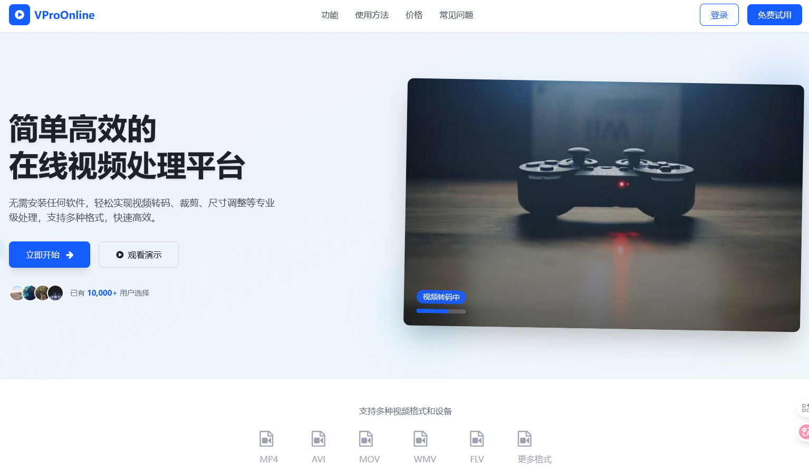

# VProOnline 在线视频处理平台

一个基于Node.js的视频上传、处理和分享平台，支持多种视频格式转换、裁剪、压缩等操作。


<div align="center">



### 🚀 快速部署

[](https://vercel.com/new/clone?repository-url=https://github.com/Alleyf/VProOnline&project-name=vpro-online&repository-name=VProOnline)
&nbsp;&nbsp;
[](https://app.netlify.com/start/deploy?repository=https://github.com/Alleyf/VProOnline)

</div>


## ✨ 功能特点

- 视频上传与存储管理
- 多种格式转换（MP4, AVI, MOV, WebM等）
- 视频裁剪与尺寸调整
- 视频压缩与质量调整
- 音频提取（MP3, WAV等格式）
- 水印添加功能
- 响应式设计，适配各种设备

## 🚀 快速开始

### 环境要求
- Node.js 16+
- npm 8+
- FFmpeg (视频处理依赖)

### 安装步骤

1. 克隆仓库：
```bash
git clone https://github.com/Alleyf/VProOnline.git
cd VProOnline
```

2. 安装依赖：
```bash
npm install
```

3. 配置环境变量：
复制`.env.example`文件并重命名为`.env`，然后修改相应配置。

4. 启动开发服务器：
```bash
npm run dev
```

5. 访问应用：
打开浏览器访问 [http://localhost:3001](http://localhost:3001)

## 🌐 Vercel一键部署

点击下方按钮一键部署到Vercel：

[](https://vercel.com/new/clone?repository-url=https://github.com/Alleyf/VProOnline)

## 📝 使用说明

1. 上传视频文件（拖放或点击选择）
2. 选择处理选项（格式、尺寸、裁剪等）
3. 开始处理并等待完成
4. 下载处理后的文件

## 🖼️ 操作流程

<table>
  <tr>
    <td width="50%">
      
      <div align="center"><b>1. 上传视频</b></div>
      <div align="center">拖放或点击选择视频文件</div>
    </td>
    <td width="50%">
      
      <div align="center"><b>2. 预览视频</b></div>
      <div align="center">查看视频信息和预览效果</div>
    </td>
  </tr>
  <tr>
    <td width="50%">
      
      <div align="center"><b>3. 选择处理选项</b></div>
      <div align="center">设置格式、尺寸等参数</div>
    </td>
    <td width="50%">
      
      <div align="center"><b>4. 获取结果</b></div>
      <div align="center">下载处理后的文件</div>
    </td>
  </tr>
</table>


## 🤝 贡献指南

欢迎提交Pull Request或Issue。


## 功能特性

- 视频上传与管理
- 视频压缩与格式转换
- 视频剪辑与裁剪
- 音频提取
- 水印添加
- 分辨率调整

## 技术栈

- 前端: HTML5, CSS3, JavaScript
- 后端: Node.js, Express
- 视频处理: FFmpeg

## 安装指南

1. 克隆仓库
```bash
git clone https://github.com/Alleyf/VProOnline.git
cd VProOnline
```

2. 安装依赖
```bash
npm install
```

3. 配置环境变量
复制`.env.example`为`.env`并修改配置

4. 启动开发服务器
```bash
npm run dev
```

## 开发脚本

- `npm run dev` - 启动开发服务器
- `npm test` - 运行测试
- `npm run lint` - 代码检查
- `npm run build` - 生产环境构建


## 👥 贡献者

感谢这些优秀的贡献者：

[](https://github.com/Alleyf/VProOnline/graphs/contributors)


## 📄 许可证

本项目采用 [MIT 许可证](LICENSE)。详情请查看 [LICENSE](LICENSE) 文件。

## 💖 支持项目

如果这个项目对你有帮助，欢迎通过以下方式支持我们：

### ⭐ GitHub Star
给我们一个 Star，这是对我们最大的鼓励！

### ☕ 为爱发电

<div align="center">


**如果你觉得这个项目有用，可以请开发者喝杯咖啡 ☕**

</div>

### 🎁 其他支持方式
- 🐛 提交 Bug 报告
- 💡 提出新功能建议
- 📝 完善项目文档
- 🔀 贡献代码
- 📢 推荐给朋友

## 📞 联系方式

如有问题或建议，请通过以下方式联系：

- 📋 提交 Issue
- 💬 发起 Discussion

---

<div align="center">

**⭐ 如果这个项目对你有帮助，请给我们一个 Star！**

**Made with ❤️ by VProOnline Team**

*让视频处理变得简单高效* 🎬

</div>


[](https://star-history.com/#Alleyf/VProOnline&Date)
